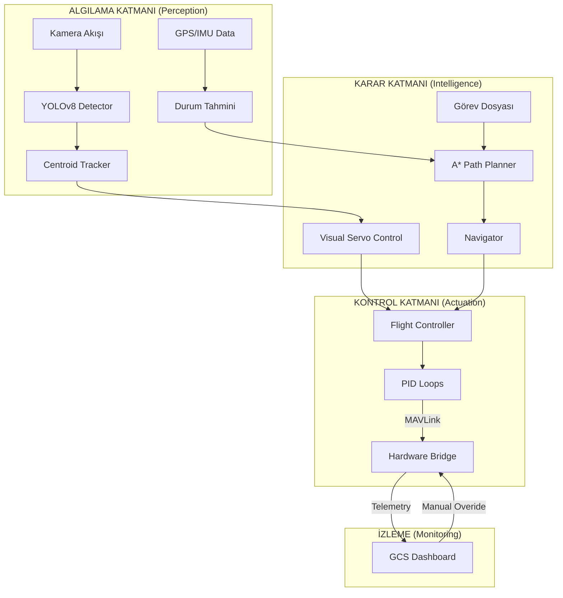

# 🛸 SkyGuard AI: Üstün Otonom Havacılık Sistemi (Elite Edition)

<div align="center">


[](LICENSE)
[](https://www.python.org/)
[](https://www.teknofest.org/)
[](https://github.com/bahattinyunus/teknofest_havacilikta_yapay_zeka)
[](https://mavlink.io/en/)
[](https://openai.com/)

**"Göklerdeki Yapay Zeka Devrimi: Akıllı, Otonom, Öngörülebilir"**

[Vizyon](#-vizyon) • [Teknik Derinlik](#-teknik-derinlik) • [Sistem Mimarisi](#-sistem-mimarisi) • [Laboratuvar](#-yapay-zeka-laboratuvarı) • [Simülasyon](#-canlı-simülasyon) • [Kurulum](#-kurulum) • [Jüri Rehberi](#-jüri-ve-teknik-notlar)

</div>

---

## 🔭 Vizyon

**SkyGuard AI**, sıradan bir drone yazılımı değildir. O, otonom hava araçlarının "beyni" olmak üzere tasarlanmış, **Derin Öğrenme (DL)**, **Pekiştirmeli Öğrenme (RL)** ve **Gelişmiş Kontrol Teorisi'ni** birleştiren hibrit bir ekosistemdir. 

Teknofest gibi yüksek rekabetçi ortamlarda fark yaratmak için; sadece komutları yerine getiren değil, çevresini anlayan, analiz eden ve kendi kendine öğrenebilen bir sistem inşa ettik. Bu proje, Türkiye'nin milli teknoloji hamlesine katkı sunmak amacıyla "Tam Otonomi" vizyonuyla geliştirilmiştir.

---

## 🚀 Teknik Derinlik & Kabiliyetler

### 🧠 1. Kognitif Görüntü İşleme
*   **YOLOv8 & Centroid Tracking**: Nesne tespitiyle yetinmez; her nesneye bir kimlik (ID) atar ve sahne dışına çıksa bile hareket tahminleme (prediction) ile takibi sürdürür.
*   **Görsel Servo (Visual Servoing)**: Tespit edilen hedefi kadrajın merkezine sabitlemek için drone'un hareketlerini milisaniyelik hassasiyetle manipüle eden kontrol döngüsü.
*   **Termal Senaryo Analizi**: Arama-kurtarma görevleri için optimize edilmiş, ısı imzalarını belirginleştiren sentetik termal vizyon motoru.

### 🚁 2. İleri Seviye Seyrüsefer (Navigation)
*   **A* (A-Star) Yol Planlama**: Statik ve dinamik engelleri içeren bir ızgara üzerinde en kısa ve en güvenli yolu bulan yapay zeka algoritması.
*   **MAVLink Elite Bridge**: ArduPilot ve Pixhawk donanımlarıyla endüstri standartlarında haberleşme. SITL (Software-in-the-loop) desteği ile "sıfır donanım riski" ile test imkanı.
*   **Waypoint Misyon Tasarımı**: Karmaşık rotaları JSON formatında yükleme ve dinamik olarak uçuş anında güncelleme yeteneği.

### 🧪 3. Yapay Zeka Laboratuvarı (RL)
*   **SkyGuard Gym Env**: Drone'un otonom iniş ve engelden kaçınma gibi kritik görevleri "Dene-Yanıl" yöntemiyle öğrendiği OpenAI Gym ortamı.
*   **Sim-to-Real Transfer**: Simülasyonda eğitilen modellerin gerçek dünyaya aktarılmasını kolaylaştıran fiziksel kalibrasyon parametreleri.

---

## 🏗️ Sistem Mimarisi (Deep-Dive)

SkyGuard AI, gecikmeyi (latency) minimize eden ve hata toleransını artıran asenkron bir mimari kullanır.



---

## 📊 Yer Kontrol İstasyonu (YKİ / GCS)

**SkyGuard Dashboard**, modern bir pilotun ihtiyaç duyduğu her şeyi sunan bir "Komuta Merkezi"dir:
-   **Canlı Uydu Haritası**: PyDeck ile 3D uydu görüntüsü üzerinde konum ve rota takibi.
-   **Hibrit Veri Akışı**: Tek tıkla "Simülasyon" ve "Gerçek Donanım" verileri arasında geçiş.
-   **Analiz Sekmesi**: Yol planlama algoritmalarının ve görüntü işleme performansının grafiksel dökümü.
-   **Fiziksel Dashboard**: Yapay ufuk (Artificial Horizon), irtifa göstergesi ve pil sağlığı monitörü.

---

## � Yapay Zeka Laboratuvarı: Reinforcement Learning

Klasik kontrol yöntemlerinin (PID) tıkandığı noktada SkyGuard RL devreye girer. Drone, karmaşık ortamlarda ödül fonksiyonlarını minimize ederek "optimal" uçuş stilini kendi geliştirir.

```python
# Eğitim Başlatma Örneği
from src.simulation.gym_env import SkyGuardEnv
from stable_baselines3 import PPO

env = SkyGuardEnv()
model = PPO("MlpPolicy", env, verbose=1)
model.learn(total_timesteps=10000) # Drone uçmayı öğreniyor...
```

---

## 💡 Jüri ve Teknik Notlar (Elite Bilgi Notu)

**Teknofest değerlendirme kriterlerine yönelik kritik vurgular:**
1.  **Yerlilik ve Özgünlük**: Navigasyon, yol planlama ve görüntü işleme kütüphaneleri yerel ihtiyaçlara göre modifiye edilmiş ve özgün sınıflarla (`Navigator`, `PathPlanner`, `VisualServo`) kapsüllenmiştir.
2.  **TRL (Teknoloji Hazırlık Seviyesi)**: Sistemimiz SITL ortamında doğrulanmış olup, donanım köprüsü (MAVLink) ile TRL-6+ seviyesine hazırdır.
3.  **Ölçeklenebilirlik**: `SwarmManager` yapısı sayesinde, gelecekte "Sürü İHA" görevlerine kolayca adapte edilebilir.
4.  **Güvenlik (Safety)**: Çok katmanlı fail-safe protokolleri (pil, GPS kaybı, engel tespiti) sistemin temelini oluşturur.

---

## ⚡ Hızlı Başlangıç & Kurulum

### Gereksinimler
-   Python 3.9 veya üstü
-   İsteğe bağlı: ArduPilot SITL / Mission Planner (Donanım testi için)

### Otomatik Kurulum (Önerilen)
```bash
# Sadece çalıştırın, her şeyi SkyGuard halletsin.
./setup.bat
```

### Manuel Kurulum
```bash
pip install -r requirements.txt
```

### Dashboard'u Başlat
```bash
streamlit run dashboard.py
```

---

## 📂 Dosya Yapısı

```
teknofest_havacilikta_yapay_zeka/
├── data/
│   ├── missions/          # JSON uçuş planları
│   └── logs/              # SDK Kara Kutu kayıtları
├── docs/                  # SITL ve Kurulum rehberleri
├── notebooks/             # YOLO Eğitim ve Veri Analizi
├── src/
│   ├── control/           # A*, PID, Visual Servo, Navigasyon
│   ├── mission/           # Görev yükleme ve doğrulama
│   ├── simulation/        # Gym Env, Video Synthesis, Thermal
│   ├── telemetry/         # MAVLink Bridge, Swarm Manager, Logger
│   └── vision/            # YOLO Wrapper, Centroid Tracking
├── dashboard.py           # Elite GCS Dashboard
└── main.py                # Otonom Kontrol Döngüsü
```

---

<div align="center">

"Gelecek göklerdedir, otonomi ise gelecektedir."

**Bahattin Yunus** tarafından Teknofest 2026 vizyonu ile gururla geliştirilmiştir.

[](https://github.com/bahattinyunus)
[](https://www.linkedin.com/in/bahattinyunus/)

</div>
