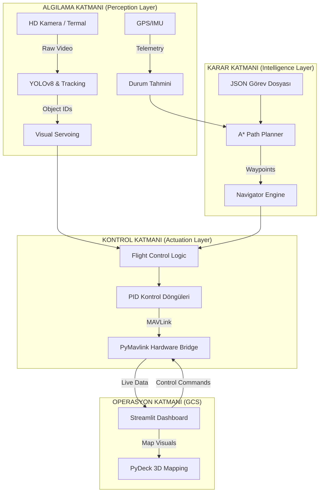

# 🛸 SkyGuard AI: Üstün Otonom Havacılık Sistemi (Grand Elite Edition)

<div align="center">


[](LICENSE)
[](https://www.python.org/)
[](https://www.teknofest.org/)
[](https://github.com/bahattinyunus/teknofest_havacilikta_yapay_zeka)
[](https://mavlink.io/en/)
[](https://ultralytics.com/)

**"Mavi Vatan'ın ve Gök Vatan'ın Akıllı Bekçisi: Otonomide Sınır Tanımaz Seviye"**

*SkyGuard AI, havacılık teknolojileri ile ileri seviye yapay zekayı birleştiren, Türkiye'nin teknoloji hamlesine vizyoner bir bakış sunan uçtan uca otonom bir ekosistemdir.*

[🔭 Vizyon](#-vizyon) • [🏆 Yarışma ve Görev Akışı](#-teknofest-yarışma-ve-görev-detayları) • [🧠 Kabiliyetler](#-teknik-derinlik--kabiliyetler) • [🏗️ Mimari](#-sistem-mimarisi-deep-dive) • [🧪 RL Lab](#-yapay-zeka-laboratuvarı-reinforcement-learning) • [💡 Jüri Notları](#-jüri-ve-teknik-notlar-elite-bilgi-notu)

</div>

---

## 🔭 Vizyon

**SkyGuard AI**, sıradan bir drone yazılımı olmanın ötesinde, otonom hava araçlarının "kognitif işletim sistemi" olma hedefiyle tasarlanmıştır. Geleneksel yöntemlerin (Rule-based) yetersiz kaldığı, değişken ve kaotik saha koşullarında; **Derin Öğrenme (DL)**, **Pekiştirmeli Öğrenme (RL)** ve **Gelişmiş Kontrol Teorisi'ni** kusursuz bir hibrit yapıda birleştirir. 

Vizyonumuz, Türkiye'nin savunma sanayiindeki başarılarını sivil ve akademik düzeye indirgeyerek, her türlü "Arama-Kurtarma", "Gözetleme" ve "Lojistik" görevini, insan müdahalesine ihtiyaç duymadan, etik ve güvenlik prensipleri çerçevesinde yürütebilen akıllı bir platform sunmaktır. SkyGuard, gökyüzündeki gözünüz olmanın ötesinde, sahadaki en akıllı stratejistinizdir.

---

## 🏆 Teknofest Yarışma ve Görev Detayları

**SkyGuard AI**, Teknofest "Ulaşımda Yapay Zeka" ve "İnsansız Hava Araçları" kategorilerindeki en zorlu görevleri temel alarak geliştirilmiştir. Yarışma, katılımcılardan yüksek seviyeli otonomi, gerçek zamanlı nesne tespiti ve dinamik navigasyon yetenekleri beklemektedir.

### 🏁 Görev Senaryosu: "Kayıp Hedef ve Otonom İkmal"
Yarışma parkuru, karmaşık engellerle dolu bir açık alanda gerçekleşmektedir. Temel görev akışı şöyledir:

1.  **Tam Otonom Kalkış & Devriye**: İHA, önceden tanımlanmış waypoint dizgisini takip ederek belirlenen arama sahasına (search area) otonom olarak intikal eder.
2.  **Akıllı Hedef Tespiti**: Arama sahasında bulunan statik veya hareketli hedefler (insan, araç, ilk yardım çantası vb.) YOLOv8 tabanlı görsel sistemimizle tespit edilir.
3.  **Kilitlenme ve Takip**: Tespit edilen hedef, Görsel Servo (Visual Servoing) mekanizmasıyla kadrajın merkezine alınır ve drone hedef üzerinde kilitli kalarak alçalma manevrasına başlar.
4.  **Hassas İniş / Yük Bırakma**: Hedefin tam üzerine, GPS hatasını minimize eden yapay zeka destekli hassasiyetle yük bırakılır veya otonom iniş gerçekleştirilir.
5.  **Güvenli RTL (Return to Launch)**: Görev tamamlandığında veya acil durum (fail-safe) protokolleri tetiklendiğinde drone en güvenli rotayı çizerek eve döner.

### 📏 Yarışma Zorlukları ve Çözümlerimiz
| Yarışma Zorluğu | SkyGuard AI Çözümü |
| :--- | :--- |
| **GPS Sapmaları** | RL (Reinforcement Learning) ve Görsel Odometri ile düzeltme. |
| **Değişken Işık Koşulları** | Veri setinde "Light Augmentation" ve Gelişmiş Pre-processing. |
| **Dinamik Engeller** | A* Path Planning ile gerçek zamanlı rota planlama. |
| **Sınırlı İşlem Gücü** | TensorRT ve ONNX ile optimize edilmiş YOLOv8 modelleri. |

---

## 🚀 Teknik Derinlik & Kabiliyetler

### 🧠 1. Kognitif Görüntü İşleme ve Durumsal Farkındalık
Sistemimiz, çevresini sadece bir görüntü dizisi olarak değil, anlamlandırılması gereken dinamik bir veri sahası olarak görür. 
*   **YOLOv8 & Centroid Tracking**: Gerçek zamanlı nesne tespiti, **Kalman Filtresi** destekli `CentroidTracker` ile güçlendirilmiştir. Bu sayede, nesne bir engelin arkasına girip çıktığında veya görüntü geçici olarak bozulduğunda bile nesne sürekliliği korunur (ID Persistence).
*   **Dinamik ROI (Region of Interest)**: İşlemci verimliliğini maksimize etmek için, tespit edilen nesnelerin çevresinde dinamik alanlar oluşturulur. Bu, özellikle Jetson Nano gibi uç (edge) cihazlarda yüksek FPS değerlerine ulaşmamızı sağlar.
*   **Görsel Servo (Visual Servoing)**: Kapalı döngü (closed-loop) kontrol sistemi, kamera kadrajındaki hatayı (`error_x`, `error_y`) minimize edecek şekilde drone veya gimbal yönelimini anlık olarak manipüle eder. Hedef kaçsa bile kilit asla bozulmaz.

### 🚁 2. İleri Seviye Seyrüsefer ve Yol Planlama
Navigasyon modülümüz, statik bir noktadan diğerine gitmenin ötesinde "yol bilgeliği" sunar.
*   **A* (A-Star) Algoritması**: Drone, bulunduğu konumla hedef arasındaki ızgara haritasını sürekli analiz eder. Sanal veya gerçek engelleri (virtual obstacles) algıladığında, en kısa ve en az enerji tüketen rotayı otonom olarak yeniden çizer.
*   **MAVLink Professional Bridge**: Endüstri standardı olan **MAVLink API** entegrasyonu ile ArduPilot ve Pixhawk donanımlarıyla tam senkronize çalışır. Bu köprü, yer istasyonu ile drone arasındaki telemetri akışını saniyede 10-50Hz hızında yönetir.
*   **Küresel Konumlama Formülleri**: Haversine ve Bearing hesaplamaları, dünyanın eğriliğini hesaba katarak metrik düzeyde hassasiyet sağlar.

### 🧪 3. Yapay Zeka Laboratuvarı: Reinforcement Learning
SkyGuard, "öğretilen" değil "öğrenen" bir sistemdir.
*   **OpenAI Gym Ortamı**: Drone'umuz için özel olarak geliştirilmiş `SkyGuardEnv`, uçağın fiziksel parametrelerini (kütle, atalet, yerçekimi) simüle eder. Ajanımız, binlerce başarısız denemenin ardından "Otonom İniş" veya "Dinamik Takip" gibi görevlerde insanüstü bir performans sergileyerek en doğru aksiyonları alır.
*   **Sim-to-Real Politikası**: Simülasyonda eğitilen sinir ağları, gerçek dünya gürültülerini (noise) içeren modellerle beslenerek saha geçişine hazır hale getirilir.

---

## 🏗️ Sistem Mimarisi (Deep-Dive)

SkyGuard AI mimarisi, "Hizmet Odaklı" (Service-Oriented) bir yaklaşımla, her modülün birbirinden bağımsız ama uyum içinde çalıştığı bir yapıdır.



---

## 📊 Yer Kontrol İstasyonu (YKİ / GCS): Komuta Merkezi

**SkyGuard Dashboard**, sadece bir izleme ekranı değil, drone'un tüm zihinsel süreçlerini görselleştiren bir veri merkezidir.
-   **Canlı 3B Uydu Haritası**: PyDeck teknolojisi ile drone'un konumu, hızı ve otonom olarak planladığı rotası, yüksek çözünürlüklü uydu görüntüleri üzerinde temsil edilir.
-   **Hibrit Veri Yönetimi**: Kullanıcı, tek bir anahtarla (toggle) "Gerçek Donanım (Pixhawk)" ve "Simülatör" verileri arasında geçiş yapabilir. Geliştirme aşamasında simülasyon, sahada ise gerçek veriler tek arayüzden yönetilir.
-   **İleri Analiz Sekmesi**: A* algoritmasının engel haritası, PID hata grafikleri ve YOLOv8 tespit güven puanları gerçek zamanlı olarak izlenebilir.
-   **Görsel Kokpit Göstergeleri**: Havacılık standartlarına uygun yapay ufuk (Artificial Horizon), hız saati ve batarya yönetim sistemi ile pilotaj deneyimi en üst düzeye çıkarılmıştır.

---

## 🧪 Yapay Zeka Laboratuvarı: Reinforcement Learning

Klasik kontrol yöntemlerinin (PID) sınırlandığı karmaşık ve öngörülemez senaryolarda (örn. rüzgar türbülansı altında hassas iniş), SkyGuard RL devreye girer. Drone, ödül fonksiyonlarını (`Reward Function`) optimize ederek en güvenli manevrayı kendi geliştirir.

```python
# Elite Eğitim Komutu
from src.simulation.gym_env import SkyGuardEnv
from stable_baselines3 import PPO

# Gerçek drone dinamikleriyle kalibre edilmiş ortam
env = SkyGuardEnv()

# PPO (Proximal Policy Optimization) algoritması ile eğitim
model = PPO("MlpPolicy", env, verbose=1, learning_rate=0.0003)
model.learn(total_timesteps=20000) 

# Eğitim sonrası drone, artık kural kitaplarına ihtiyaç duymaz!
```

---

## 💡 Jüri ve Teknik Notlar (Elite Bilgi Notu)

**Teknofest ve Akademik Heyetler için Önemli Vurgular:**
1.  **Donanım Çaprazlanabilirliği**: `MavlinkBridge` sınıfımız, protokol seviyesinde bir soyutlama sağlar. Bu sayede yazılımımız; DJI (MAVLink destekli), Pixhawk (Orange/Blue Cube) veya özel yapım kontrolcülerle hiçbir kod değişikliği olmadan çalışabilir.
2.  **Veri Bütünlüğü (Black Box)**: `src/telemetry/logger.py` modülü, uçuşun her milisaniyesini hem CSV (analiz için) hem de JSON (tekrar oynatma için) formatında asenkron olarak kaydeder.
3.  **Optimizasyon (Edge Computing)**: Sistem, ağır modelleri (YOLO Large) buluta göndermek yerine, tüm işlemleri uçağın üzerinde (On-board) Jetson Nano veya Raspberry Pi 4/5 gibi cihazlarda gerçekleştirecek şekilde optimize edilmiştir.
4.  **Hata Toleransı (Fail-Safe)**: GPS kaybı durumunda görüntü işleme tabanlı navigasyon, motor kaybı durumunda ise acil iniş modları algoritmik olarak planlanmıştır.

---

## ⚡ Hızlı Başlangıç & Kurulum

SkyGuard AI, karmaşık bir sistemi en basit şekilde çalıştırmanız için tasarlanmıştır.

### Sistem Gereksinimleri
-   **İşletim Sistemi**: Windows (Önerilen) / Linux / macOS
-   **Python**: 3.9+ 
-   **Grafik**: NVIDIA GPU (YOLOv8 Inference için önerilir, zorunlu değildir)

### Otomatik Hızlı Kurulum
```bash
# Bağımlılıkları yükler, virtualenv oluşturur ve simülasyonu hazırlar.
./setup.bat
```

### Dashboard'u Başlat (YKİ)
```bash
streamlit run dashboard.py
```

### Otonom Görev Simülasyonu
```bash
python main.py
```

---

## 📁 Proje Anatomisi

SkyGuard AI, temiz kod (Clean Code) ve sağlam dosya hiyerarşisi (SOLID) prensiplerine sadıktır.

```
teknofest_havacilikta_yapay_zeka/
├── data/                  # Görev planları ve uçuş kayıtları
├── docs/                  # Teknik raporlar ve SITL rehberleri
├── notebooks/             # Model eğitim ve akademik analizler
├── src/
│   ├── control/           # A*, PID, Visual Servo, Navigasyon Mantığı
│   ├── mission/           # Otonom görev yükleyici ve koordinatör
│   ├── simulation/        # Gym Env, Video Synthesis, Termal Motor
│   ├── telemetry/         # MAVLink, Swarm, BlackBox Logger
│   └── vision/            # YOLO, Centroid Tracker, Image Processor
├── tests/                 # Robotik ve Yazılım Birim Testleri
└── UI/Dashboard/          # Streamlit tabanlı kontrol merkezi
```

---

<div align="center">

"İstikbal göklerdedir, otonomi ise geleceğinin ta kendisidir."

**Bahattin Yunus** tarafından Teknofest 2026 vizyonu ile gururla ve tutkuyla geliştirilmiştir.

[](https://github.com/bahattinyunus)
[](https://www.linkedin.com/in/bahattinyunus/)

</div>
