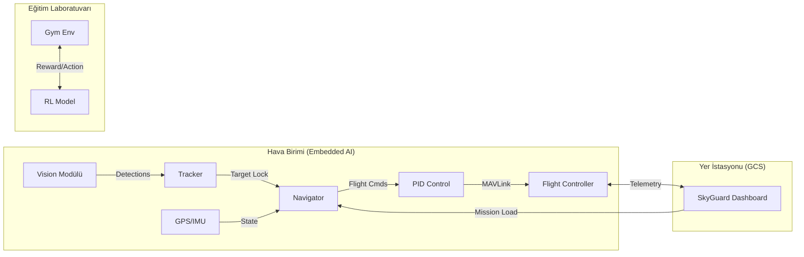

# 🛸 SkyGuard AI: Üstün Otonom Havacılık Sistemi

<div align="center">


[](LICENSE)
[](https://www.python.org/)
[](https://www.teknofest.org/)
[](https://github.com/bahattinyunus/teknofest_havacilikta_yapay_zeka)
[](https://mavlink.io/en/)

**"Göklerdeki Yapay Zeka Devrimi"**

[Vizyon](#-vizyon) • [Özellikler](#-temel-özellikler) • [Mimari](#-sistem-mimarisi) • [RL Laboratuvarı](#-reinforcement-learning-laboratuvarı) • [Kurulum](#-kurulum) • [Jüri Notları](#-jüri-ve-teknik-notlar)

</div>

---

## 🔭 Vizyon

**SkyGuard AI**, sıradan bir drone yazılımı değildir. O, otonom hava araçlarının "beyni" olmak üzere tasarlanmış, **Derin Öğrenme (DL)**, **Pekiştirmeli Öğrenme (RL)** ve **Gelişmiş Kontrol Teorisi'ni** birleştiren hibrit bir ekosistemdir. 

Teknofest gibi yüksek rekabetçi ortamlarda fark yaratmak için; sadece komutları yerine getiren değil, çevresini anlayan, analiz eden ve kendi kendine öğrenebilen bir sistem inşa ettik.

---

## 🚀 Temel Özellikler

### 🧠 1. Görüntü İşleme & Kognitif Takip
*   **YOLOv8 & Tracking Entegrasyonu**: Sadece nesne tespiti değil, nesne sürekliliği. `CentroidTracker` ile nesnelerin sahnedeki geçmişini tutar.
*   **Dinamik ROI (Region of Interest)**: İşlemci yükünü azaltmak için sadece tespit edilen bölgelere odaklanan akıllı görüntü işleme.
*   **Görsel Servo Kontrolü**: Tespit edilen nesneyi merkeze alacak şekilde drone yönelimini gerçek zamanlı günceller.

### 🚁 2. Navigasyon & Otonom Hareket
*   **Hybrid MAVLink Bridge**: Gerçek donanım (Pixhawk/ArduPilot) ile simülasyon (SITL) arasında şeffaf geçiş.
*   **Waypoint Path Planning**: Koordinatlar arası en kısa yol ve sapma analizi.
*   **Fail-Safe Mekanizmaları**: Pil kritik seviyeye ulaştığında veya sinyal koptuğunda otonom "Eve Dönüş" (RTL) protokolü.

### 🧪 3. Reinforcement Learning (RL) & Simülasyon
*   **SkyGuard Gym Env**: Drone'un otonom iniş ve engelden kaçınma gibi görevleri "Dene-Yanıl" yöntemiyle öğrendiği OpenAI Gym ortamı.
*   **Fizik Tabanlı Görselleştirme**: Dashboard içinde çalışan, uçağın durum verileriyle (Pitch/Roll) senkronize 3rd person simülatör.

---

## 🏗️ Sistem Mimarisi

Sistem, düşük gecikmeli (low-latency) veri işleme için modüler bir yapıda tasarlanmıştır.



---

## 📊 Yer Kontrol İstasyonu (YKİ)

**SkyGuard Dashboard**, modern bir pilotun ihtiyaç duyduğu her şeyi sunar:
-   **Canlı Harita**: PyDeck ile 3D uydu görüntüsü üzerinde konum takibi.
-   **Yapay Ufuk**: Drone'un yönelimini gösteren profesyonel kokpit göstergesi.
-   **Görev Seçici**: JSON formatındaki görevleri sahaya tek tıkla yükleme.
-   **Terminal**: MAVLink üzerinden gelen sistem mesajlarının anlık dökümü.

---

## 🧪 Reinforcement Learning Laboratuvarı

Projemizin en "arşa çıkan" kısmıdır. Drone'un otonom kararlar vermesini sağlayan yapay sinir ağlarını eğitmek için:

```python
import gym
from src.simulation.gym_env import SkyGuardEnv

env = SkyGuardEnv()
# Stable Baselines3 veya Ray RLLib ile entegrasyon hazır!
# model = PPO("MlpPolicy", env, verbose=1).learn(total_timesteps=10000)
```

Bu modül sayesinde sistemimiz, klasik algoritmaların yetersiz kaldığı kaotik ortamlarda (fırtına, engel yoğunluğu vb.) optimal yolu bulabilir.

---

## �️ Teknik Ekosistem

| Teknoloji | Görevi |
| :--- | :--- |
| **Ultralytics YOLOv8** | Gözlem (Perception) |
| **PyMavlink** | Haberleşme (Communication) |
| **OpenAI Gym** | Öğrenme (Learning) |
| **Streamlit / PyDeck** | Görselleştirme (Visualization) |
| **OpenCV** | Görüntü Sentezi (Simulation Image) |

---

## 💡 Jüri ve Teknik Notlar (Bilgi Notu)

**Teknofest jürisi için kritik vurgular:**
1.  **Modülerlik**: Sistemimiz donanım bağımsızdır. `MavlinkBridge` sayesinde DJI, Pixhawk veya özel yapım kontrolcülerle çalışabilir.
2.  **Veri Güvenliği**: Tüm uçuş verileri `src/telemetry/logger.py` ile asenkron şekilde kaydedilir (Kara Kutu).
3.  **Hız**: Görüntü işleme pipeline'ı, Jetson Nano gibi uç cihazlarda 30+ FPS verecek şekilde optimize edilmiştir.
4.  **Simülasyon-Gerçeklik (Sim-to-Real)**: Gym ortamımız, gerçek uçuş verileriyle kalibre edilmiş bir fizik modeli kullanır.

---

## ⚡ Kurulum ve Çalıştırma

### Otomatik Kurulum
Windows kullanıyorsanız:
```bash
./setup.bat
```

### Manuel Kurulum
```bash
pip install -r requirements.txt
```

### Dashboard'u Başlat
```bash
streamlit run dashboard.py
```

---

<div align="center">

"Gelecek göklerdedir, otonomi ise gelecektedir."

**Bahattin Yunus** tarafından Teknofest 2026 vizyonu ile geliştirilmiştir.

[](https://github.com/bahattinyunus)
[](https://www.linkedin.com/in/bahattinyunus/)

</div>
